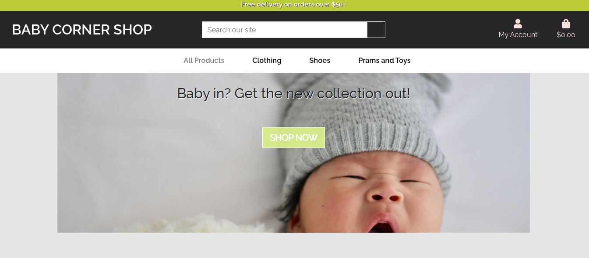

# BABY CORNER SHOP Store

## Milestone Project 4

- This project aims to build a full-stack web application using Django full-stack web framework, HTML, Css3 and JavaScript.

  - The e-commerce web application for a fictional baby clothes shopping features e-commerce functionality, payments using Stripe, a blog section, user login using Facebook, a wishlist section for registered users, confirmation emails, CRUD functionality for admin to add blog posts and stock items, and an admin section, for the admin user to access database records.

  - Since this website is for educational purposes only, it is higly recommended not to enter your personal card details. Instead, use the Stripe functionality  set up to accept the test card details:

        - card number : 4242 4242 4242 4242
        - Any date
        - Any CVV number.

## Live project

- [View the live project here.](https://gille-baby-corner.herokuapp.com/)

  - ### Landing page Hero Section.

  - ### Landing page Shop Our Collections.

If you're accessing it from your terminal, you'd need to install couple of things first. Please, follow the instructions mentioned below.

Accessing from the Gitpod terminal:
- pip3 install django
- pip3 install django-allauth==0.41.0
- pip install Pillow
- python3 manage.py migrate
- python3 manage.py loaddata categories
- python3 manage.py loaddata projects

Accessing as a superuser:
- python3 manage.py createsuperuser
and insert your name, email and password.

heroku login -i
heroku config:set DISABLE_COLLECTSTATIC=1 --app gille-baby-corner

